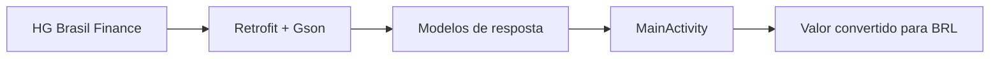

# Conversor de Moedas · Android

**Uma aplicação nativa que consulta cotações e converte valores para reais.**

`Kotlin` · `Android` · `Retrofit` · `Gson` · `XML Views`

## A experiência

Selecione uma moeda, informe um valor e veja sua conversão para reais. O projeto explora a comunicação entre uma interface Android e uma API externa, desde a consulta assíncrona até a apresentação do resultado.

| Moeda de origem | Resultado |
| :--- | :--- |
| Dólar americano · USD | Real brasileiro · BRL |
| Euro · EUR | Real brasileiro · BRL |
| Peso argentino · ARS | Real brasileiro · BRL |

## O que foi implementado

- Consulta de cotações à API HG Brasil Finance.
- Seleção da moeda em um componente da interface.
- Entrada de valor e validação de preenchimento numérico.
- Conversão pela cotação de compra retornada pela API.
- Exibição do resultado em reais e aviso de falha na consulta.

A conversão é demonstrativa: não inclui tarifas, impostos, compra de moeda ou operações financeiras. Não há cache offline implementado.

## Da API à tela

| Parte | Localização |
| :--- | :--- |
| Interface e conversão | `MainActivity.kt` |
| Cliente HTTP e contrato | Pacote `api` |
| Estrutura da resposta | Pacote `model` |
| Layouts e recursos | `app/src/main/res` |

## Abrir no Android Studio

1. Clone o repositório e abra a pasta no Android Studio.
2. Use uma versão compatível com o **Android Gradle Plugin 9.1.1** declarado no projeto.
3. Instale os componentes de SDK solicitados durante a sincronização. O módulo declara `compileSdk` 37 com minor API 1, `minSdk` 36 e `targetSdk` 36, com compatibilidade Java 21.
4. Configure sua própria chave da HG Brasil Finance no contrato de consulta em `FinanceApi.kt`; não publique suas credenciais.
5. Execute em dispositivo ou emulador compatível com **API 36 ou superior**, com acesso à internet.

Esses requisitos refletem os arquivos Gradle versionados. A disponibilidade do SDK e a compatibilidade do ambiente precisam ser atendidas para compilar.

## Aprendizados

Integração REST em Android, desserialização de JSON, chamadas assíncronas com Retrofit, componentes de interface e tratamento básico de entradas e falhas de rede.

[**Conheça o portfólio de Clayton Brito →**](https://github.com/GhostRiley115)
